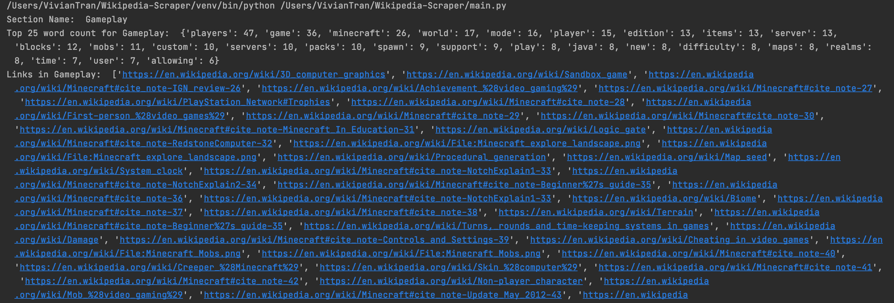

# Wikipedia-Scraper

This repository contains a Python script that will take a Wikipedia page URL as input and print out the page's sections, the frequent words within each section (excluding stop words), and the links contained each section. To access this code, you can find it in main.py (scroll all the way to the bottom of main.py and you can designate a URL to see  and test out how the script functions).

### What I Did

---

To give some idea as to how this script works, I had first compiled a list of stopwords from various libraries and combined them into a singular list of 411 stop words. The libraries that I ended up using to get these stop words include NLTK, Spacy, and Stop_Words.

I wrote a helper function (called count_words) to take the text within a section and return the word count of all words within the section. The word count is returned as a dictionary that is sorted in descending order so that the most frequent words can be seen first.

Lastly, I wrote the main function that uses methods from Beautiful Soup to read the contents of the Wiki page, print out the section names of the Wiki page (section names were typically under an h2 tag and a class called mw-headline), uses the helper function to print out the word frequency dictionary, and print out an array containing the links in each section.

### What Does The Output Look Like

---
This is an example output for what it looked like when I scrapped and printed the section, word frequency, and links for the Minecraft Wiki page.

### Things To Note / Improvements That Could Be Made

---

1. Within the links list, there are links that would've been broken if I had not URL encoded some punctuation marks like apostrophes and brackets in the URL link. I had wrote conditions that covered apostrophes and parentheses, but there may be some that I haven't caught due to it not being in the Wikipedia pages I used to test my code. This same issue may apply to word count - I had stripped the punctuation from the string but there may be some obsolete punctuation marks that I wasn't able to strip nor the library I used was able to catch.
2. I included the text from citation text tables (like the one shown below) into the word count for the section it is located in. There was no class name to be used uniformly across all lack of citation notifications for different Wiki pages, so I thought it'd be best to include it.

3. Images are included within the links list as well as any other links that may redirect the user to a different section of the same Wikipedia page. In addition, edit links and reference links were also included.
4. I did not include anything outside of the constraints - anything that existed above the very first section listed in the Contents table of the Wiki page was not included. To elaborate, essentially the first chunk of the Wikipedia page that usually describes/defines the page's contents was not included as the Contents table did not list it as a section.
